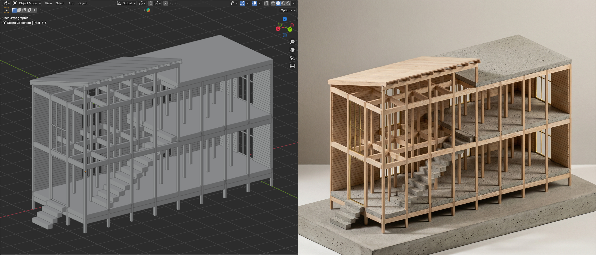

# CraftBot



*Blender model generated with the Python code output of Experiment 08 (left), and its physical model visualization (right). The input for generation was a 27-page PDF "The Segal Method", a special issue of The Architect's Journal from 1986.*

CraftBot is an architect AI agent. It interprets design briefs, grounds its thinking in domain knowledge through ingesting documents, images and other references, and outputs Python code that procedurally defines a building design. Instead of producing meshes or images, CraftBot writes scripts that construct architectural geometry in Blender. From there, it can produce a range of industry standard representations - floorplans, sections, elevations, BIM models, bills of quantities etc. It can work in a fully automated iterative loop of code generation, execution, visual feedback, and revision. More broadly, CraftBot is a research project exploring whether large language models can participate meaningfully in architectural design when constrained to operate through executable CAD code.

This repo hosts code files, iteration steps, references and outputs from previous experiments, enabling anyone to build upon CraftBot with minimal friction by pointing their own agent to it. Python and Blender were specifically chosen to facilitate ease of access; both are open-source, well-maintained, have a large community of users, and are free for commercial use. 

A draft paper describing the project is in [`papers/`](papers/):

> *CraftBot: An LLM Interlocutor in a Code-First Approach to Architectural Design* (short paper, submitted to ICCC 2026)

## Repository structure

```
papers/         Draft paper PDF
experiments/    13 experiments, one folder each
tools/          Helper scripts for running experiments
outputs/        Default folder for headless renders (gitignored)
```

Each experiment folder follows the same layout:

- `input/` — everything given to the model: the prompt log (`experiment_XX_prompts_chatgpt51.txt`), reference PDFs/images, and the shared Python geometry library (`craftbot_lib.py`) with an element placement template
- `ChatGPT 5.1/` — outputs per iteration: generated Python scripts (`vXX.py`) and Blender viewport screenshots of the resulting models
- `references/` (some experiments) — additional reference and annotation images used during the iteration loop

## Experiments

All experiments were run with ChatGPT 5.1 (November 2025 – January 2026), grouped by the type of reference material used:

**Visual references** — 01 Carport (king post truss), 02 Gothic Carport (hammer beam truss), 03 VIPP Shelter, 06 Prouvé 6x6 Demountable House

**Hybrid references (images + text)** — 04 Construction Manual (prefabricated timber house), 05 Construction Manual Meta-Prompt, 07 Gehry Deconstruction, 08 The Segal Method, 09 How to CLT (ten-story building), 10 Staircase, 11–13 Hip Roof / Dormer Window / Roof Sheathing

## Headless execution

Experiment scripts can be executed without opening the Blender GUI using [`tools/run_experiment_headless.py`](tools/run_experiment_headless.py). The wrapper runs an experiment script in background Blender, frames the generated geometry with an orthographic (parallel) camera so the whole model is always visible, renders four orbit views with the Workbench engine (visually similar to solid-mode viewport screenshots), and saves the resulting `.blend` file:

```
blender --background --python tools/run_experiment_headless.py -- <experiment.py> <lib_dir> [out_dir]
```

- `<experiment.py>` — path to the experiment script to execute
- `<lib_dir>` — folder containing `craftbot_lib.py` (the experiment's `input/` folder)
- `[out_dir]` — optional output folder for `view_1..4.png` and `model.blend`; defaults to `outputs/<experiment_name>/` (gitignored)

Example (Windows):

```
"C:\Program Files\Blender Foundation\Blender 5.1\blender.exe" --background --python tools\run_experiment_headless.py -- "experiments\01_Carport_Assembly_Blender_Python\ChatGPT 5.1\experiment_01_chatgpt51_v01.py" "experiments\01_Carport_Assembly_Blender_Python\input"
```

## Web viewer

A lightweight WebGL viewer for all generated models lives in [`viewer/`](viewer/) and deploys to GitHub Pages. Since `.blend` files are not stored in the repo, each experiment script is executed once in headless Blender and exported to a compact JSON model format (`viewer/models/`, typically 10–20× smaller than the corresponding `.blend`). The viewer is a static site — vanilla ES modules with [three.js](https://threejs.org) from a pinned CDN, no build step.

Features: model/agent/iteration picker, six render styles (plaster, solid, random, blueprint, 1-bit dither, pixel), GPU-driven entry animations (elements drop/rise/assemble in construction order or layer by layer), layer toggles with material takeoff (length, volume, weight), section planes on three axes, orthographic view presets with a 4-view mode, and hover/click element inspection with dimensions.

Run locally:

```
python -m http.server -d viewer 8123
```

Re-export models after adding or changing experiment scripts (uses headless Blender):

```
python tools/export_all_models.py            # everything
python tools/export_all_models.py --only 08  # one experiment / pattern
```

Deployment: pushes to `main` publish `viewer/` via `.github/workflows/pages.yml`. One-time repo setting: *Settings → Pages → Source: GitHub Actions*.

## Notes

- Original ChatGPT conversation logs are not yet included; they may be added later.
- This README will be updated as the research progresses.

## About

The project author is Luka Piškorec, previously a lecturer at Aalto University and researcher at ETH Zürich. He is a co-founder of TEN Studio (Zürich and Belgrade) and {protocell:labs} (Helsinki), practices that work at an intersection of architecture, design, digital art and research.

The project is part of [art-ai-fact](https://www.aalto.fi/en/research-art/art-ai-fact) initiative funded by Aalto University in 2025-2026.
