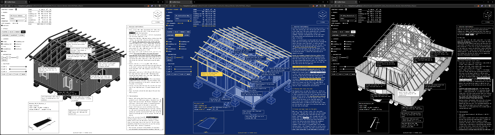

# CraftBot


*Blender model generated with the Python code output of Experiment 08 (left), and its physical model visualization (right). The input for generation was a 27-page PDF "The Segal Method", a special issue of The Architect's Journal from 1986.*

CraftBot is an architect AI agent. It reads a design brief, grounds itself in domain knowledge by ingesting documents, images and other references, and outputs Python code that defines a building procedurally. Instead of producing meshes or images, CraftBot writes scripts that construct architectural geometry in Blender. From there it can produce the industry's standard representations: floorplans, sections, elevations, BIM models, bills of quantities. It can run in a fully automated loop of code generation, execution, visual feedback and revision. CraftBot is a research project asking whether large language models can take part in architectural design when they are constrained to work through executable CAD code.

This repo holds the code, iteration steps, references and outputs of the experiments so far, so anyone can build on CraftBot by pointing their own agent at it. Python and Blender were chosen for ease of access: both are open source, maintained, widely used, and free for commercial use.

A draft paper describing the project is in [`papers/`](papers/):

> *CraftBot: An LLM Interlocutor in a Code-First Approach to Architectural Design* (short paper, submitted to ICCC 2026)

## Repository structure

```
papers/         Draft paper PDF
experiments/    13 experiments, one folder each
manuals/        Timber construction manuals as extracted .md summaries, with INDEX.md (the PDFs themselves are gitignored)
skills/         Distilled modelling knowledge from the experiments, one skill per folder
tools/          Shared modelling kits and harness scripts (see tools/README.md)
viewer/         Web viewer: static site plus the exported models in viewer/models/
visuals/        Figures used in this README
outputs/        Default folder for headless renders (gitignored)
.claude/        Claude Code command /run-experiment, which starts an experiment run
.github/        GitHub Pages workflow that publishes viewer/ on every push to main
```

Each experiment folder follows the same layout:

- `input/` holds everything given to the model: the prompt log (`experiment_XX_prompts_chatgpt51.txt`), reference images, and the shared Python geometry library (`craftbot_lib.py`) with an element placement template. Experiments 04, 08, 09, 11 and 13 also used a construction manual PDF; it was removed from the repository for copyright reasons, an `original_pdf_provenance.txt` in the folder names it, and the extracted summary used during the run stays next to it.
- `ChatGPT 5.1/` holds the outputs per iteration: generated Python scripts (`vXX.py`) and Blender viewport screenshots of the resulting models.
- `Fable/` (ten experiments so far) holds the same per-iteration outputs from the Fable runs, plus the design rationale document, callouts file and archived conversation.
- `references/` (some experiments) holds additional reference and annotation images used during the iteration loop.

## Experiments

The experiments started in November 2025 with ChatGPT 5.1 (runs through January 2026); other agents followed, with Fable runs added in August 2026, and the series is ongoing as of September 2026. Grouped by the type of reference material used:

**Visual references.** 01 Carport (king post truss), 02 Gothic Carport (hammer beam truss), 03 VIPP Shelter, 06 Prouvé 6x6 Demountable House

**Hybrid references (images and text).** 04 Construction Manual (prefabricated timber house), 05 Construction Manual Meta-Prompt, 07 Gehry Deconstruction, 08 The Segal Method, 09 How to CLT (ten-story building), 10 Staircase, 11 to 13 Hip Roof, Dormer Window and Roof Sheathing

## Skills

[`skills/`](skills/) holds knowledge distilled from the experiments: principles, methods and techniques extracted from the Fable design rationale documents and the reference documents, formatted as agent skills. Each skill is a folder with a `SKILL.md` whose frontmatter description says when to load it. They are written to be usable outside this repo. For Claude Code, place them in your `.claude\skills\` folder, or add one line to `CLAUDE.md` telling the agent to check [`skills/`](skills/) and load the relevant `SKILL.md` files before starting an experiment. The second method works with any agent.

| Skill | Load when |
|---|---|
| [working-from-reference-documents](skills/working-from-reference-documents/SKILL.md) | the experiment is grounded in a construction manual or guide |
| [reading-visual-references](skills/reading-visual-references/SKILL.md) | dimensions or topology must be read off photos, drawings or plans |
| [procedural-geometry](skills/procedural-geometry/SKILL.md) | writing Blender Python that generates construction geometry |
| [non-orthogonal-geometry](skills/non-orthogonal-geometry/SKILL.md) | sloped, tilted, twisted or warped surfaces are involved |
| [verifying-models](skills/verifying-models/SKILL.md) | setting up or running the render-inspect-revise loop |
| [timber-framing](skills/timber-framing/SKILL.md) | modelling framed timber structures or reviewing them as structures |
| [roof-framing-and-sheathing](skills/roof-framing-and-sheathing/SKILL.md) | modelling pitched roofs, sheathing or coverings |
| [modular-grids-and-panelization](skills/modular-grids-and-panelization/SKILL.md) | prefabrication, panels, sheet materials, CLT, multi-storey systems |
| [extending-previous-models](skills/extending-previous-models/SKILL.md) | continuing or layering onto a previous experiment's model |
| [writing-design-rationale](skills/writing-design-rationale/SKILL.md) | closing out a run, before archiving the transcript |
| [running-craftbot-experiment](skills/running-craftbot-experiment/SKILL.md) | running a whole experiment in this repo, start to finish (repo-specific: folders, `tools/`, viewer export) |

The interpenetration check the skills refer to is [`tools/check_overlaps.py`](tools/check_overlaps.py), the SAT test from the Fable render harnesses. It runs on any saved `.blend`.

## Tools

[`tools/`](tools/) is the code side of the same distillation: the geometry helpers the Fable runs converged on, extracted into importable modules so a new experiment starts from them instead of deriving them again. [`tools/README.md`](tools/README.md) lists every module and function. In short:

| Module | What it gives an experiment script |
|---|---|
| [`craftbot_lib.py`](tools/craftbot_lib.py) (V 2.0) | `place_element` as before, plus nested collections, `box` from corner coordinates, convex prisms |
| [`geometry2d.py`](tools/geometry2d.py) | polygon clipping, member spacing, sheet tiling with holes, walls minus openings (pure Python, unit-tested) |
| [`planes.py`](tools/planes.py) | half-spaces, plane intersections, `Roof` planes, members built long and clipped (rafters, hips, braces, plates) |
| [`ruled.py`](tools/ruled.py) | bilinear surfaces for warped and leaning walls and roofs |
| [`framing.py`](tools/framing.py) | stud walls with openings, cladding, decks, boards, solid walls with openings, roof layers, stairs |
| [`sheathing.py`](tools/sheathing.py) | mitred board sheathing on planar facets, hip dropping, protrusion check |
| [`render_views.py`](tools/render_views.py) | headless renders with outlines, colours, hidden layers, close-ups and section cuts, plus the overlap check |
| [`experiment_template.py`](tools/experiment_template.py) | starting point for a new experiment script |

Point your agent at both folders in its project instructions, one line each, as described under Skills above.

## Headless execution

[`tools/run_experiment_headless.py`](tools/run_experiment_headless.py) executes an experiment script without opening the Blender GUI. It runs the script in background Blender, frames the generated geometry with an orthographic camera so the whole model is always visible, renders four orbit views with the Workbench engine (close to solid-mode viewport screenshots), and saves the resulting `.blend` file:

```
blender --background --python tools/run_experiment_headless.py -- <experiment.py> <lib_dir> [out_dir]
```

- `<experiment.py>` is the path to the experiment script to execute.
- `<lib_dir>` is the folder containing `craftbot_lib.py` (the experiment's `input/` folder).
- `[out_dir]` is an optional output folder for `view_1..4.png` and `model.blend`; it defaults to `outputs/<experiment_name>/` (gitignored).

Example (Windows):

```
"C:\Program Files\Blender Foundation\Blender 5.1\blender.exe" --background --python tools\run_experiment_headless.py -- "experiments\01_Carport_Assembly_Blender_Python\ChatGPT 5.1\experiment_01_chatgpt51_v01.py" "experiments\01_Carport_Assembly_Blender_Python\input"
```

## Web viewer



*CraftBot viewer interface: exp 06 Prouvé Cabanon (left, MONO 1 mode), exp 04 Construction Manual (middle, BLUEPRINT mode) and exp 07 Gehry Deconstruction (right, MONO 2 mode) with callouts linking to a design rationale document*

A WebGL viewer for all generated models lives in [`viewer/`](viewer/) and deploys to [GitHub Pages (live link)](https://lukapiskorec.github.io/craftbot).

Since `.blend` files are not stored in the repo, each experiment script is executed once in headless Blender and exported to a compact JSON model format in `viewer/models/`, typically 10 to 20 times smaller than the corresponding `.blend`. The viewer is a static site: vanilla ES modules with [three.js](https://threejs.org) from a pinned CDN, no build step.

Features:

- A model and agent picker with an iteration slider. The camera stays put when switching iterations and only the elements that changed animate in.
- Seven render styles: plaster, solid, random, mono, wireframe, blueprint and 1-bit dither. Mono, wireframe and dither each have a light and a dark mode; clicking random again re-rolls its palette. The shaded styles carry screen-space ambient occlusion and thin black outlines to match the Blender Workbench renders, glazing is drawn semi-transparent, and the GUI re-themes itself with the active style.
- GPU-driven entry animations: elements drop, rise or assemble in construction order or layer by layer.
- Eight layer toggles (frame, exterior and interior cladding, interior boards, roof, floors, foundations, fixtures) with an always-visible material takeoff (length, volume, weight).
- Section planes on three axes, and a Blender-style navigation cube with a 4-view mode in which the three fixed views share one wheel zoom.
- Hover and click element inspection: a name and layer tag at the cursor, picking that works through section cuts, and the element's true oriented length, width and thickness drawn in the active style.
- For Fable runs, the design rationale document in a panel under the view cube, with callouts on the model (tags with leader lines, authored per run in `experiment_NN_fable_callouts.json`) that link groups of elements to passages of the document. Click a tag to jump to the passage; hover a heading to see its callouts.
- On phones the GUI starts collapsed with one section open at a time.

Run locally:

```
python -m http.server -d viewer 8123
```

Re-export models after adding or changing experiment scripts (uses headless Blender):

```
python tools/export_all_models.py               # everything
python tools/export_all_models.py --only 08     # one experiment / pattern
python tools/export_all_models.py --index-only  # no Blender: index + rationale docs only
python tools/layers.py --audit                  # every element name family -> viewer layer
python tools/layers.py --bake                   # re-bake layers into viewer/models/*.json
python tools/callouts.py --check                # validate the rationale callout files
python tools/callouts.py --names 04             # element name patterns, for authoring callouts
```

The index step also copies each `experiments/<exp>/Fable/experiment_NN_fable_design_rationale.md` to `viewer/models/<exp>/fable_rationale.md` so the viewer can show it. The exporter re-winds meshes to face outward (some generators emit inside-out prisms); the viewer applies the same fix when parsing older exports.

Deployment: pushes to `main` publish `viewer/` via `.github/workflows/pages.yml`. One-time repo setting: *Settings, Pages, Source: GitHub Actions*.

## Notes

- Original ChatGPT conversation logs are not yet included; they may be added later.
- This README will be updated as the research progresses.

## About

The project author is Luka Piškorec, previously a lecturer at Aalto University and researcher at ETH Zürich. He is a co-founder of TEN Studio (Zürich and Belgrade) and {protocell:labs} (Helsinki), practices that work at the intersection of architecture, design, digital art and research.

The project is part of the [art-ai-fact](https://www.aalto.fi/en/research-art/art-ai-fact) initiative funded by Aalto University in 2025-2026.
